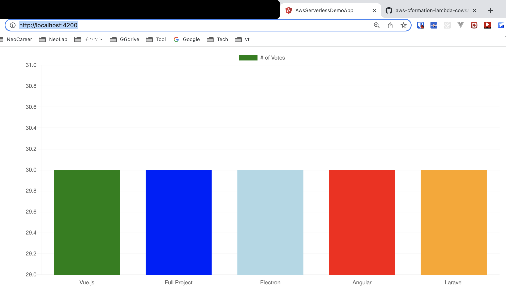

# aws-connect-angularspa-to-lambda-apigw-cors 🐳


[](https://github.com/tquangdo/aws-connect-angularspa-to-lambda-apigw-cors/issues/new)


## reference
[youtube](https://www.youtube.com/watch?v=eracVWTSqLs)

## deploy local
### 1/ install
```shell
npm i # check `package.json` already had "ng" or NOT
npm start
->
> ng serve
** NG Live Development Server is listening on localhost:4200, open your browser on http://localhost:4200 **
```
### 2/ run
- access `http://localhost:4200` on browser, will see all bar's height are the same (=30)


## src code
- edit in `src/app/topics.service.ts`
```ts
fetchData(): Observable<TopicsDataPoint[]> {
    return this.http.get('https://0qrt4ncli5.execute-api.us-east-1.amazonaws.com/dev/simple-test')
      .map((result: Response) => result.json());
    // return Observable.create((observer: Observer<TopicsDataPoint[]>) => {
    //   setTimeout(() => {
    //     observer.next([
    //       { title: 'Vue.js', value: 30 },
    //       { title: 'Full Project', value: 30 },
    //       { title: 'Electron', value: 30 },
    //       { title: 'Angular', value: 30 },
    //       { title: 'Laravel', value: 30 }
    //     ])
    //   }, 2000);
    // })
  }
```

## lambda `dtq-simple-api-test`


## api gateway `dtq-simple-api-gw`
- Actions=`Create Resource` > name=`simple-test` > `Enable API Gateway CORS`=☑️
- Actions=`Create Method` > `GET` > Integration type=`Lambda` > Lambda=`dtq-simple-api-test` > Add Permission=`OK`
- Actions=`Deploy API` > Stage name=`dev`

- access `https://0qrt4ncli5.execute-api.us-east-1.amazonaws.com/dev/simple-test` on browser:
```json
[
    {
        title: "Vue.js",
        value: 42
    },
    {
        title: "Full Project",
        value: 28
    },
    {
        title: "Electron",
        value: 26
    },
    {
        title: "Angular",
        value: 25
    },
    {
        title: "Laravel",
        value: 21
    }
]
```
- click `Resources` > click `/simple-test` > Actions=`Enable CORS` > click button `Enable CORS ...`

- Actions=`Deploy API` > Stage name=`dev`

## result
- access `http://localhost:4200` on browser, will see all bar's height are different (42>28>26>25>21)

